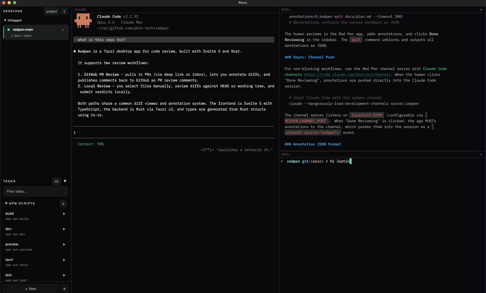

# Roux



A desktop terminal multiplexer for [Claude Code](https://docs.anthropic.com/en/docs/claude-code), built with Tauri and Svelte.

Roux lets you run multiple Claude Code sessions side-by-side with split panes, stacked tabs, shell terminals, and persistent layouts -- all in a single native window.

## Features

- **Multi-session** -- Run independent Claude Code sessions, each with its own git worktree
- **Split panes** -- Horizontal and vertical splits with same-direction flattening
- **Stacked panes** -- Zellij-style tab stacking where collapsed title bars show inactive panes
- **Collapsible session rail** -- Collapse the sidebar to a slim strip of session dots without losing quick session switching
- **Session restore on reconnect** -- Restore full split/shell layouts when reconnecting a saved session
- **Session history** -- Closing a session archives it into a restorable history pane instead of immediately hard-deleting the record
- **Shell terminals** -- Open shell panes alongside Claude for running commands
- **Command palette** -- Quick access to all actions via the primary shortcut (`cmd+k` on macOS, `ctrl+k` on Windows/Linux)
- **Leader mode** -- Vimish pane/session commands via `cmd+;`
- **Configurable keymap** -- Edit `~/.config/roux/keymap.kdl`, switch between `default` and `tmux`, and reload shortcuts without restarting
- **Layout persistence** -- Pane layouts survive app restarts; shell panes respawn automatically
- **Themes** -- Separate GUI and terminal themes, including imported user `.itermcolors` terminal themes
- **Projects** -- Group sessions across repos, save session blueprints, and inject project context
- **Multi-scoped notes vault** (experimental) -- Plain-text notes sidebar (`cmd+b`) with four scopes (global / project / repo / session), backed by an Obsidian-compatible markdown vault at `~/Documents/Roux`. Scriptable from `roux notes <scope> <verb>` and surfaced to agents via per-PTY `ROUX_*_NOTES_*` env vars.
- **Command panes** -- Run shell commands in dedicated panes with rerun support
- **Task runner** -- Run predefined commands from configuration files
- **Document viewer** -- Open markdown files in dedicated panes
- **Session from PR URL** -- Paste a GitHub PR URL in New Session and auto-prepare a local review worktree
- **Native menu bar** -- File/Edit/View/Session/Pane/Tools/Window/Help menus wired to the same command registry and keymap as the palette
- **Doctor panel + setup automation** -- Verify/reinstall CLI, hooks, and Claude skill from Settings
- **Worktree templates + close policy** -- Use path templates and choose keep/ask/remove behavior on close
- **Notification center** -- In-app notifications, unread badges, OS notification fan-out, and Claude/Codex setup checks
- **Multiline editor** -- `ctrl+g` opens a compact editor docked to the active terminal pane, with selected-terminal-text reinput, command corrections, context chips, and shell-style editing keys
- **CLI** -- `roux-cli` for scripting: split panes, create sessions, run commands, send text, and focus panes from the terminal via the local Roux command channel

## Keybindings

| Action | Shortcut |
|---|---|
| Split horizontal | `cmd+d` |
| Split vertical | `cmd+shift+d` |
| Close pane | `cmd+w` |
| Toggle stack | `cmd+shift+s` |
| Focus left | `alt+h` |
| Focus down | `alt+j` |
| Focus up | `alt+k` |
| Focus right | `alt+l` |
| Toggle notes | `cmd+b` |
| Toggle sessions history | `cmd+; t s` |
| Toggle multiline editor | `ctrl+g` |
| Toggle multiline editor from anywhere | `cmd+shift+e` |
| Open multiline editor with clipboard | `cmd+shift+v` |
| Command palette | `cmd+k` |
| New session | `cmd+n` |
| Settings | `cmd+,` |

These are the defaults from the bundled `default` keymap. Roux also ships a `tmux` preset, and every shortcut is editable in `~/.config/roux/keymap.kdl`.

## Tech Stack

- **Frontend** -- Svelte 5, TypeScript, Tailwind CSS 4, xterm.js
- **Backend** -- Rust, Tauri 2, portable-pty
- **Build** -- Vite

## Development

```bash
npm install
task dev
```

### Tests

```bash
task test             # full frontend + Rust gate
npm run test          # frontend tests only
npm run test:watch    # frontend watch mode
npm run check         # svelte type check
```

### Windows

Native Windows x64 builds are supported with a per-user NSIS installer:

```powershell
task windows:build
```

See [docs/windows-build.md](docs/windows-build.md) for prerequisites, installer output, and current platform limitations.

## Release

Version bump, tag, and push:

```bash
task version BUMP=patch
task version BUMP=minor
task version BUMP=major
```

Build, sign, notarize, and staple on a signing Mac:

```bash
op run --env-file=.env.signing -- task sign
```

Create or update the GitHub release for the current version and upload the signed artifacts:

```bash
task publish
```

Or do signing and publishing together:

```bash
task publish:op
```

Publish the current prerelease docs alias after a prerelease tag exists:

```bash
task docs:prerelease VERSION=0.5.4-pre.1
```
